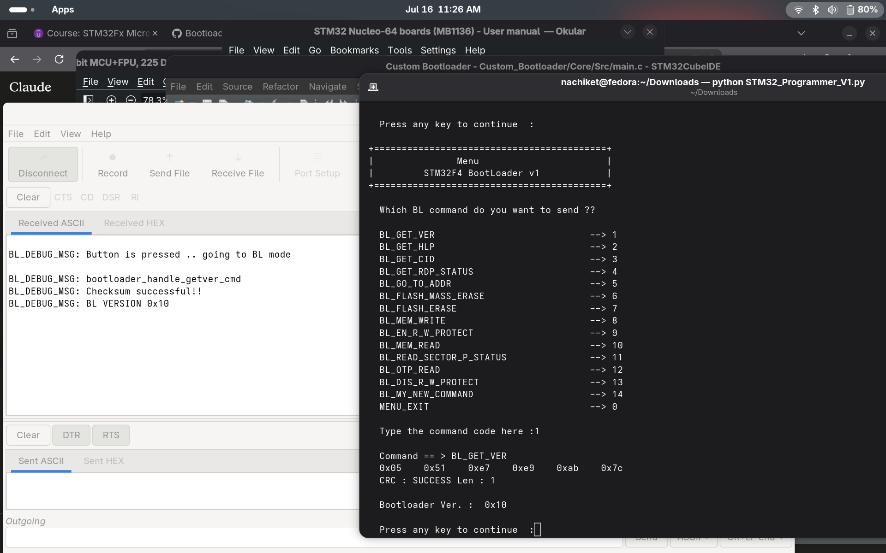
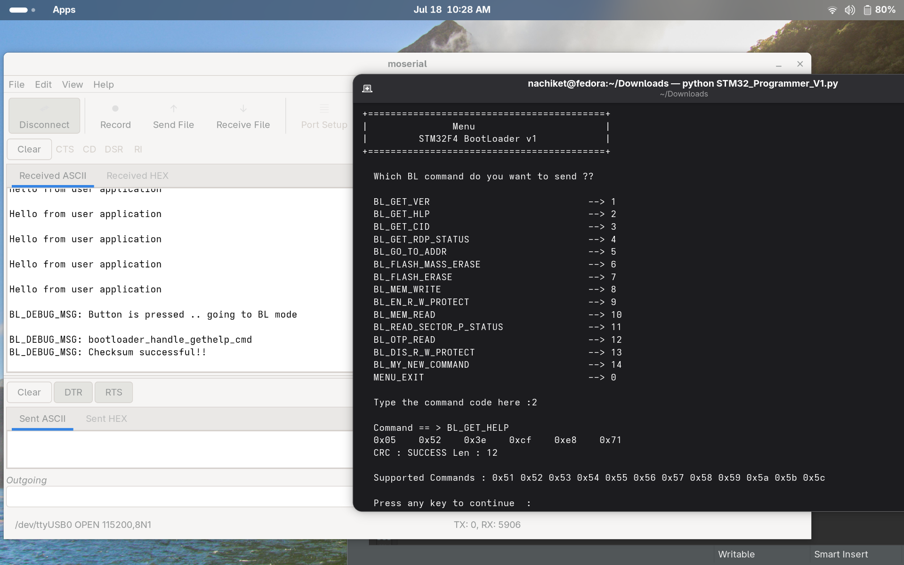
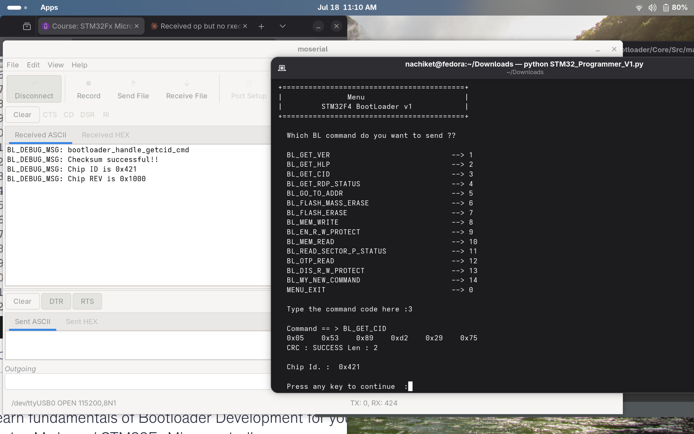
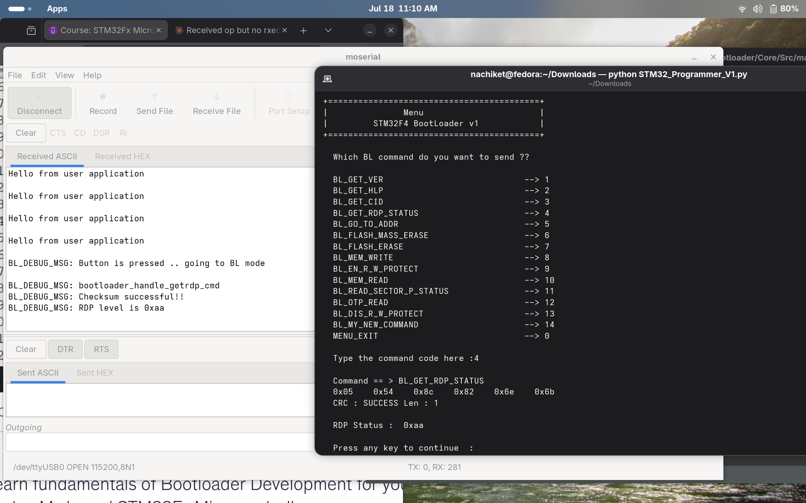
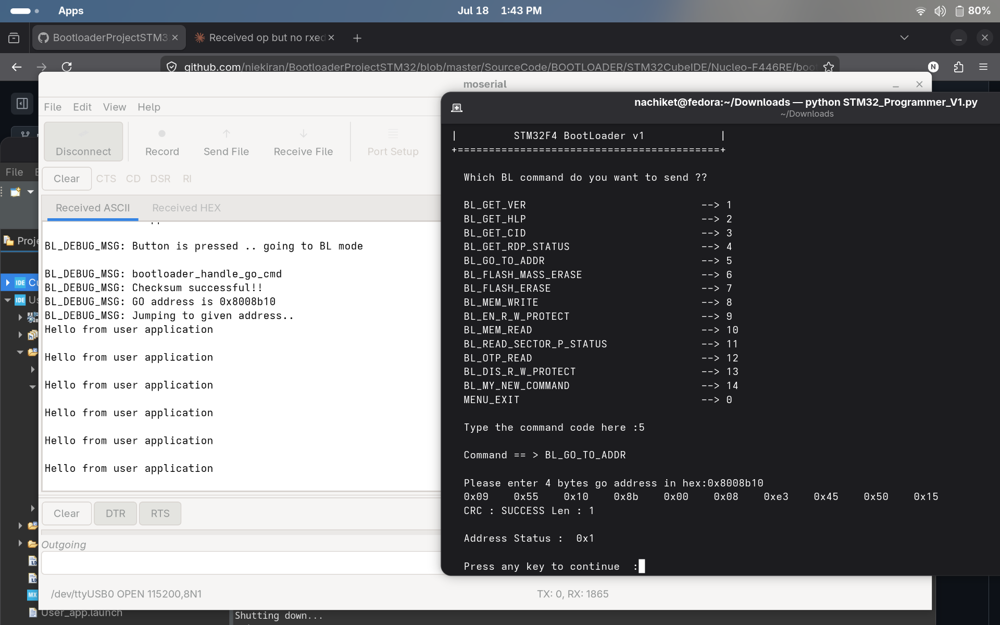
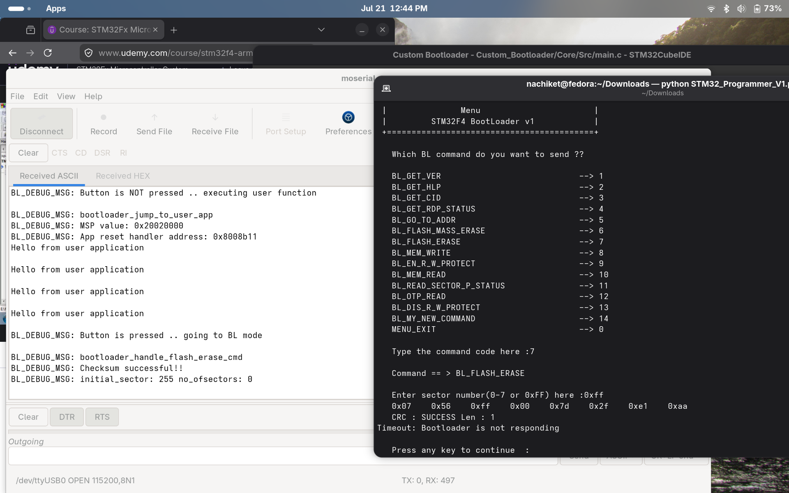
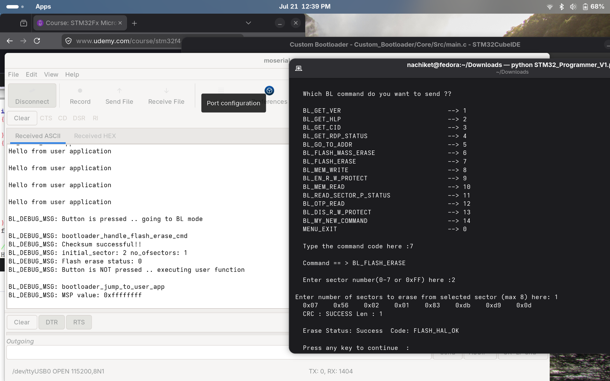

# Bootloader Command Ouput

Per-command details and captured host/target output for the custom bootloader protocol. See the main [README](../README.md) for the overall protocol format and setup instructions.
### GET_VER

### GET_HELP

### GET_CID

### GET_RDP_STATUS

### GO_TO_ADDR

### FLASH_MASS_ERASE

### FLASH_ERASE

### MEM_WRITE

### EN_R_W_PROTECT

### MEM_READ

### READ_SECTOR_P_STATUS

### OTP_READ

### DIS_R_W_PROTECT

### MY_NEW_COMMAND
